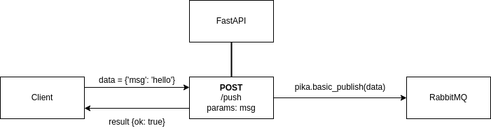
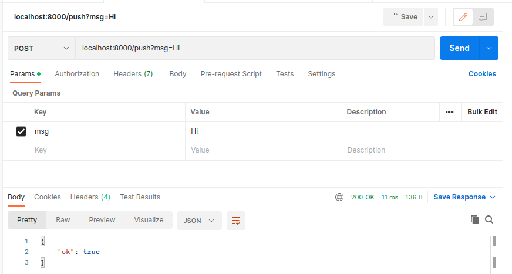
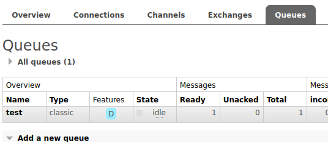
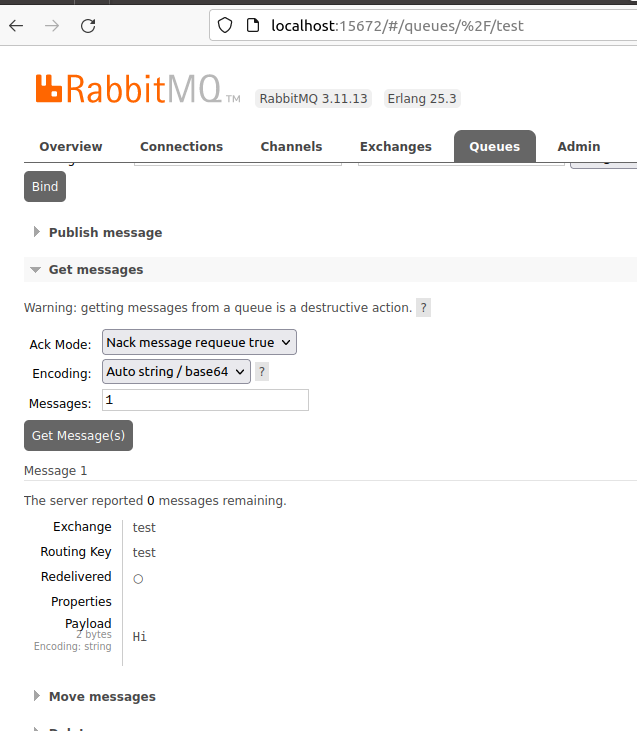

In this post we'll look at how we can make a FastAPI RabbitMQ producer that pushes messages into a RabbitMQ Queue using pika's python library. In this guide we will:

1. REST call from client browser to FastAPI
2. FastAPI receives rest call
3. Within the API call, connect to RabbitMQ via pika's python library
4. Use pika's ```basic_publish``` function to push data to RabbitMQ  


**Pre-requisites**
- Python 3
- [FastAPI](https://fastapi.tiangolo.com/)
- [RabbitMQ](https://www.rabbitmq.com/) 
- [pika](https://pika.readthedocs.io/en/stable/) python library
- front end client or anything that can make a REST call (In this example I use [Postman](https://www.postman.com/downloads/))

<br/>

## The [non-async] solution

In this scenario, to avoid any sort of async or multi-threading design complications, we assume that we do all our RabbitMQ processes within an API call. The functions for each API route might look like a normal synchronous function, but underneath it's still async as mentioned in the [docs](https://fastapi.tiangolo.com/advanced/async-tests/). 

For this to work we also assume that anything we send to our API should not take a long time to push to rabbitMQ. This is because we will be "blocking" the API from returning anything whilst we use pikato send data to RabbitMQ.



<br/>

## FastAPI script + python pika to connect to RabbitMQ

Here's a FastAPI example script that listens to /push (POST). It accepts a string param called ```msg``` and then pushes that message to RabbitMQ.

Note: I setup my RabbitMQ server with a docker using a community docker image from RabbitMQ [Official install page](https://www.rabbitmq.com/download.html) for quick and easy setup. Because of this I didn't need any other parameters when connecting to the RabbitMQ server.


```python
# FastAPI script with a rabbitMQ producer using pika

from fastapi import FastAPI
import pika

app = FastAPI()

# Setup RabbitMQ connections with pika
# Your setup may be different dependingon how you setup your RabbitMQ server
# I setup my RMQ server as default, from a community docker image
connection = pika.BlockingConnection(pika.ConnectionParameters('localhost'))
channel = connection.channel()


@app.post("/push")
def push_to_rmq(msg: str):
    try:
        # Pushes message to RabbitMQ exchange called "test" 
        # which routes it to our "test" queue
        channel.basic_publish(exchange="test",
                            routing_key="test",
                            body=msg)
    except Exception as e:
        return {"ok": False, "msg": e}
    return {"ok": True}

```


<br/>

## The Result

First client sends a REST (POST) call to our api, with param ```msg``` set to "Hi". I use [Postman](https://www.postman.com/) to emulate a client and make the rest call to our API.



We publish to an exchange called "test" which routes our message to the "test" queue and then, When we go to the RabbitMQ dashboard, we can see that the message is in the queue



When we examine the messages in the queue, we can see that it is the message we sent (see where it says "payload: Hi").



<br/>

## Conclusion - Keep it simple as long as you can

Obviously there may be a use case where you'd want to properly setup async when making a RabbitMQ producer with your FastAPI program. But this will all depend on your use-case. In my opinion if it is not required, try to keep things as simple as possible like I did in my case where I just connected and pushed to RabbitMQ everytime there is an API call because to be honest that is one of the goals of RabbitMQ - that you only keep a connection open when needed. But also that adding async capabilities to your RabbitMQ Producer can cause some unneeded complexity!

Anyways, I hope this post helps you!

John