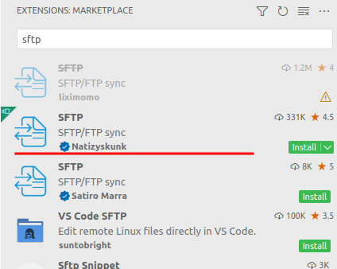
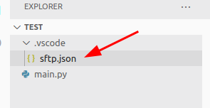
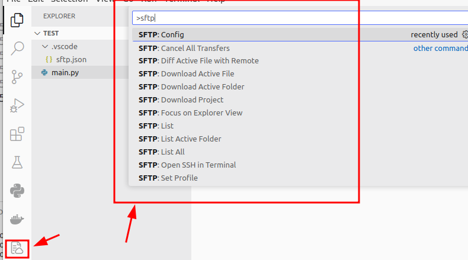
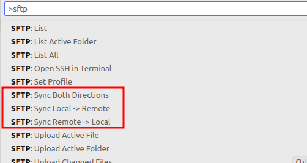
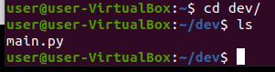

Sometimes if you're like me, you need to run code in a remote server, may it be for security reasons, or just that the services your code uses is in a remote server.

Thankfully it's quite easy to do local and remote sync in Visual Studio Code (VSCode) thanks to the SFTP plugin:

**Prerequisites**
- VSCode
- SSH connection to a remote server

<br/>

## 1. Download and Install the SFTP extension



There are quite a few sftp extensions, but this version by [@Natizyskunk](https://github.com/Natizyskunk/) was the one I found the most convenient to use.

<br/>

## 2. Setup the SFTP configs for your project
- Open your project on VScode
- Press ```Ctrl```+```Shift```+```P``` OR ```F1```
- Type ```SFTP``` and select "SFTP:config"


This will create a ```sftp.json``` file inside your project. This will contain the settings of your sftp connection for your specific project. This means that you will have a different sftp connection for each project!



Fill in the config details, usually the default config fields is enough, and you just need to change the values. Then save your changes.


```json
// sftp.json
{
    "name": "test-server",  // name of your server
    "host": "192.168.0.250",  // host url/ip of your remote server
    "protocol": "sftp", 
    "port": 22,
    "username": "user",  // username to access remote server
    "remotePath": "/home/user/dev",  // where you want the project saved in the remote server
    "uploadOnSave": true,
    "useTempFile": false,
    "openSsh": true
}
```

For others who have SSH configs setup for authentication to your remote server, you can use the ```privateKeyPath``` field to provide a path to your private key from your local machine 



<br/>

## 3. Sync between local and remote server

After you've saved your configs, the SFTP icon on the side-bar should pop up AND when you press ```Ctrl```+```Shift```+```P``` OR ```F1``` you'll have access to a whole host of options  



For me its just these 3 options that I need and that's it.



Now we check that the files have been synced to the remote server:



<br/>

## Potential Issues you might run into
- **Permission Denied error**: If you run into permission denied errors, make sure to check your remotePath in the ```sftp.json``` and make sure it's a folder that your username access has write access to. I made the classic mistake of setting remotePath to /dev when I needed root access to do that.
- **SSH authentication error**: Make sure to specify the agent, and sshConfigPath and also privateKeyPath (unless the private key is already specified in your ssh config file) 
- **Deleted File changes not being reflected automatically** - This can be quite a dangerous feature, but if you're happy with files being auto deleted on your remote then the ```watcher.autoDelete``` will do the trick