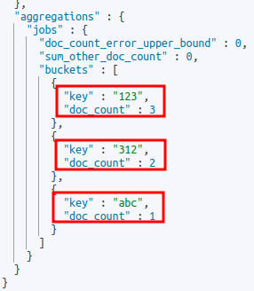
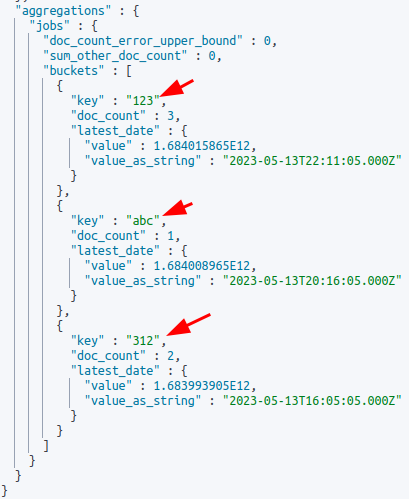
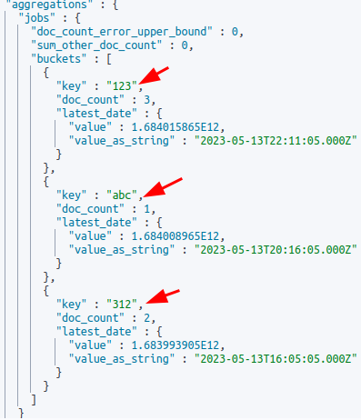

By Default Elasticsearch's aggregation tends to **sort your buckets based on count**. We want to be able to sort out buckets based on which buckets are "newer". 

One particular use case I always find myself in is that I have logs that have a field called job_id. I'd like to group all the jobs IDs that are the same (using terms aggregation), and then I'd like to **sort the list of job ID groups based on which one is the newest**.

**Pre-requisites**
- tested on Elasticsearch 7.9.3

<br>

## Simplified Example Data and Explanation
Let's look at a **simplified** version of our **example data** so that we understand what we are trying to work with:


```json
{"id": "123", "time": "5pm", "msg": "blahh" },
{"id": "abc", "time": "4pm", "msg": "blahh" },
{"id": "123", "time": "3.30pm", "msg": "blahh" },
{"id": "123", "time": "3pm", "msg": "blahh" },
{"id": "312", "time": "2pm", "msg": "blahh" },
{"id": "312", "time": "1pm", "msg": "blahh" },
```



You can see that we have 3 unique IDs ```123```, ```abc```, ```312```

If we use Elasticsearch's [terms aggregation](https://www.elastic.co/guide/en/elasticsearch/reference/7.17/search-aggregations-bucket-terms-aggregation.html) without any sorting, the **default order** in which out buckets will be arranged will be:
- 123
- 312
- abc

but the arrangement **we want** is:
- 123
- abc
- 312

```312``` should be last because its latest log is the oldest of the 3 IDs.


<br/>

## Actual Elasticsearch Example

Here's our data:


```json
{"job_id": "123", "datetime": "2023-05-13T22:11:05+00:00", "msg": "sixth" },
{"job_id": "abc", "datetime": "2023-05-13T20:16:05+00:00", "msg": "fifth" },
{"job_id": "123", "datetime": "2023-05-13T19:30:05+00:00", "msg": "fourth" },
{"job_id": "123", "datetime": "2023-05-13T18:40:05+00:00", "msg": "third" },
{"job_id": "312", "datetime": "2023-05-13T16:05:05+00:00", "msg": "second" },
{"job_id": "312", "datetime": "2023-05-13T15:20:05+00:00", "msg": "first" }
```


Here we use [terms aggregation](https://www.elastic.co/guide/en/elasticsearch/reference/7.17/search-aggregations-bucket-terms-aggregation.html) to group our unique IDs: 


```json
GET /test-index/_search
{
  "size": 0, 
  "aggs": {
    "jobs": {
      "terms": {
        "field": "job_id.keyword",
        "size": 10
      }
    }
  }
}
```


Here's the result - As expected, you can see that they are **ordered based on*** ```count``` and **not** in the order we want:



<br/>

## Solution 1 - Using Max aggregation

1. We get the latest date value of each bucket using another aggregation called [max aggregation](https://www.elastic.co/guide/en/elasticsearch/reference/7.17/search-aggregations-metrics-max-aggregation.html). 
2. We can use the ```order``` key on our terms aggregation (job_id) to sort our buckets.
3. We use the generated 'latest date' in our terms aggregation's order key.



```json
GET /test-index/_search
{
  "size": 0, 
  "aggs": {
    "jobs": {
      "terms": {
        "field": "job_id.keyword",
        "size": 10,
        "order": {
          "latest_date": "desc"
        }
      },
      "aggs": {
        "latest_date": {
          "max": {
            "field": "datetime"
          }
        }
      }
    }
  }
}
```


And as for the result, you can see that the order of our aggregated buckets **is now based on which is the newest**:



<br/>

## Solution 2 - Using Bucket Sort

Personally I much **prefer the first solution since it's a lot simpler**, but Elasticsearch's [bucket sort](https://www.elastic.co/guide/en/elasticsearch/reference/7.17/search-aggregations-pipeline-bucket-sort-aggregation.html) is another great way to sort our buckets. **Bucket sort is much more powerful** and can **combine a variety of different sorting requirements**, but for our use case solution 1 is really all we need.

Essentially the **difference** with this and the 1st solution is that **instead** of using the ```order``` key as part of the ```terms aggregation```, we basically **replace** it with a ```bucket sort aggregation``` (sort_bucket_by_latest_date) at the **same level** as the ```max aggregation``` (named latest_date).



```json
GET /test-index/_search
{
  "size": 0,
  "aggs": {
    "jobs": {
      "terms": {
        "field": "job_id.keyword",
        "size": 10
      },
      "aggs": {
        "latest_date": {
          "max": {
            "field": "datetime"
          }
        },
        "sort_bucket_by_latest_date": {
          "bucket_sort": {
            "sort": [
              {
                "latest_date": {
                  "order": "desc"
                }
              }
            ]
          }
        }
      }
    }
  }
}
```


The result (the same):



<br/>

## Conclusion

Thanks for reading! I've struggled with this problem a lot, and it's caused a lot of unexpected hidden bugs (I'd always try to figure out why my logs are missing) and so I hope this helps you! 

If you've got other ways of achieving this sorting capabilitiy, I'd be very curious to know too!

John