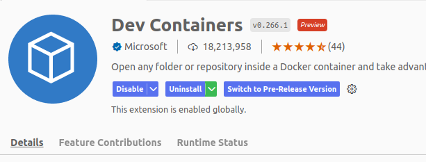
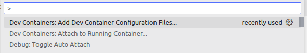
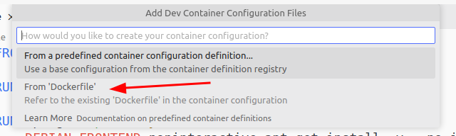
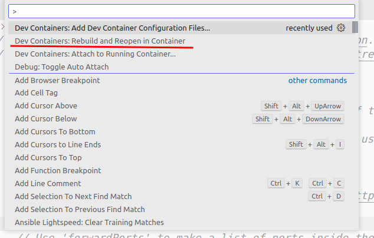
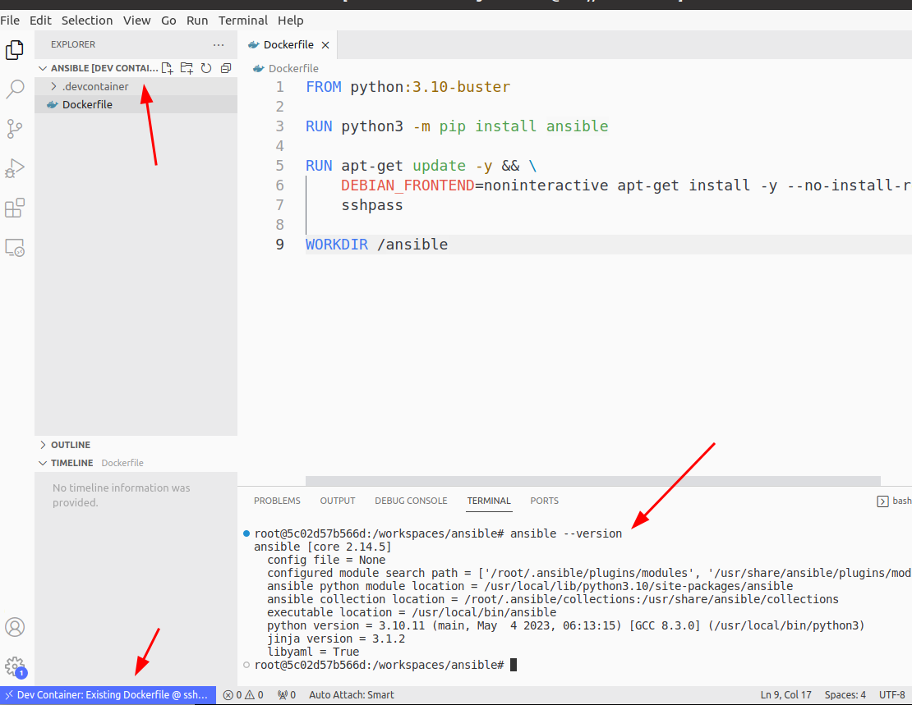

## Benefits of Running Ansible inside a docker container

Q. Why would you want to run your Ansible environment **inside a docker container** you ask? 

*Simply so that I can isolate my Ansible environment (and even have multiple versions of it?)*

Q. But then, can't you just use a **Virtual Machine** like VirtualBox or even other containerization tools like Linux Containers (LXD)? 

*Well, I prefer Docker since it's much more *lightweight. Also, using Docker Files allow us to **set up and make changes to environments more quickly**, whilst also making it easier to manage **multiple versions of our environments**. Plus docker even has a massive pool of **pre-built images** to pull from making our environment setup even easier*

Q. A docker container has no GUI - wouldn't it be a hassle to develop your playbooks there? 

*Yes, but I'll be using VS Code's dev container so that **my local source Ansible playbook code/script will automatically be in sync with our Ansible docker container**. I would still create my container using a Dockerfile but with the dev containers extension, it allows me to run my code inside our Ansible docker container whilst staying in sync with the original source code location - perfect for isolated development!*  

<br/>


## Environment requirements
We will be installing the latest version of Ansible at the time of writing (Ansible-core 2.14)

If you want more detailed information on setting up Ansible, check [this](https://docs.ansible.com/ansible/latest/installation_guide/intro_installation.html#control-node-requirements).

### Container OS
We will use **Debian 10** (Buster), but most UNIX-like OS like Unix, Red Hat and Cent OS etc. will work.

### Control Node
The **Control Node** is our container that is going to be running Ansible - this is our docker container. Since we will be using the latest version of Ansible, we will need an **environment running python 3.9+**

### Managed Node(s)
The **Managed Node(s)** are all the nodes that our Ansible instance may be controlling or talking to. Since we're using the latest version of Ansible, we will need either **python 2.7 or 3.5+ installed**.

> Note: Python 2.7 has the biggest version compatibility range, so it may be the most convenient version to install if you're not yet sure what version of Ansible you'll be using   

### Ansible (full) vs Ansible-core (minimal)
Since **we want access to all the packages and collections** we will be using ```ansible```, but if you just need the **minimal** and just core Ansible functionality, then ```ansible-core``` is enough. 

<br/>

## Ansible Docker File setup

We use the ```python:3.10-buster``` Docker base, to make things easier (so we don't need to install python)


```dockerfile
FROM python:3.10-buster

RUN python3 -m pip install ansible  
# If you want to install ansible-core, just run the same command but with "ansible-core" instead of "ansible"

RUN apt-get update -y && \
    DEBIAN_FRONTEND=noninteractive apt-get install -y --no-install-recommends \
    sshpass

WORKDIR /ansible
```


<br/>


## Method 1 - If you just want to run Ansible inside your docker container

If you just want to run an interactive CLI version, then this will do:

```bash
docker build -t ansible .
docker run -it ansible
```

You'll get the following:


If you want to **copy your playbook scripts to the docker container** then you can just add a command or run command to your Docker File to copy your Ansible Playbook files the container.

The only **downside** to this is you have to **rebuild and re-run the container every time you make changes** to your playbooks

<br/>

## Method 2 - Using Dev Containers
I **Highly recommend** this method. Even if it means you have to switch to VS Code.

### 2a. Install the extension
Install the Dev Containers' extension from VS Code extensions



### 2b. Setup Dev Containers config
Press ```Ctrl``` + ```Shift``` + ```P``` and then Search for "Dev Containers: Add Dev Container Configuration Files..."



It will prompt you if you want to set up your container configuration from a predefined source or a Docker File - select Docker File



You'll get a file/folder that looks like this at the root of your project folder


Press ```Ctrl``` + ```Shift``` + ```P``` and search for "Dev Containers: Rebuild and Reopen container"




Wait for the build to finish and for VS Code to switch context within the dev container. 

> You can see that bottom right icon shows we are inside the dev container, you can even see the terminal is set to the terminal within, and that Ansible is installed 



<br/>

## Advantages of using Dev Containers for Ansible development inside docker

- You **don't need to rebuild** your docker container every time you have script/code changes
- Any **code changes** you make inside a dev container is **automatically synced with your local repo**. This is because of the way dev containers work - dev containers simply link your source code folder to a mount point inside the dev container!

<br/>


## Method 3 - Remote Dev
If you really don't want to use VS Code, or I'm simply terrible at convincing you, You can always stick to **method 1** and then just **use an IDE that provide a "remote development"** plugin which essentially allows you to **remote SSH into your docker container**. This will also usually give you access to your docker container's **terminal for running Ansible CLI commands** and similar to dev containers, **your source code/scripts gets linked to your docker container** so that you don't need to manually transfer files every time you make script/code changes  

<br/>

## Conclusion

Anyway, I hope this guide helps. So far I have been enjoying using the docker dev container workflow for any kind of development work, which is what led me to this. Even better as it ties in really well transitioning your development environments for production quite well!

John