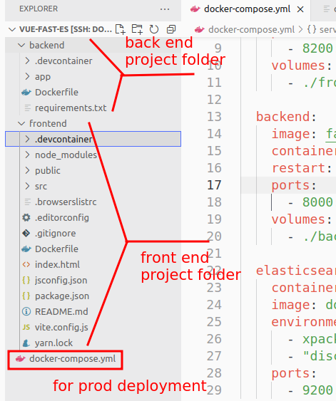
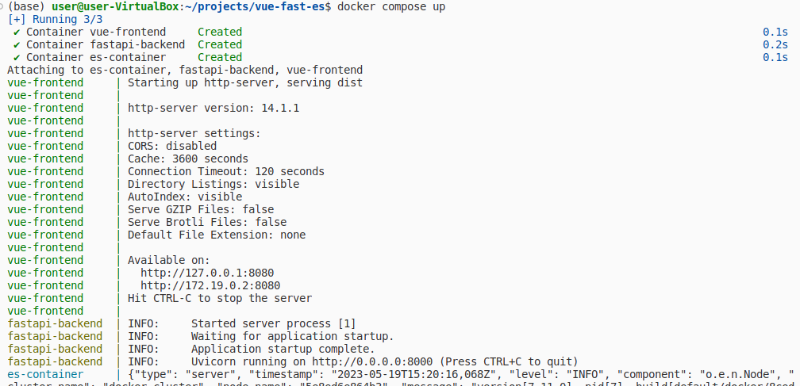
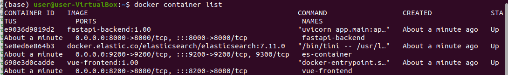
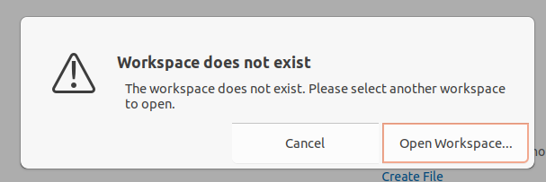
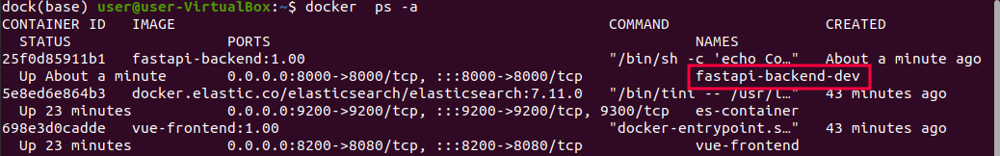
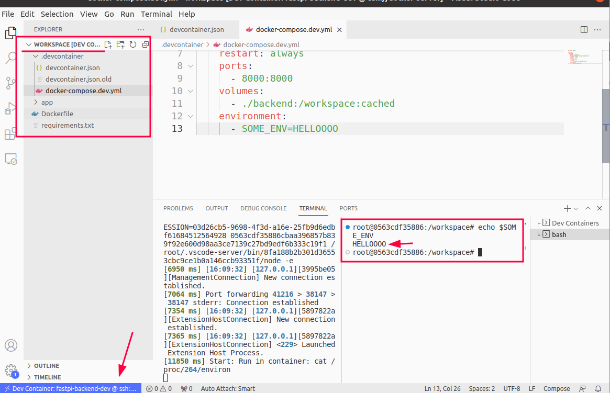
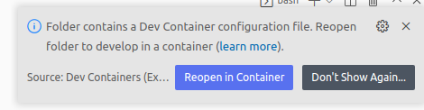

## Common Deployment Problems
Often times, as developers we are **working across a tech stack** (LAMP, MEAN, MERN) and you may need be **working on multiple services simultaneously**.

For example, I tend to use this kind of stack:
- Database: Elasticsearch
- Frontend: VueJS
- Backend: FastAPI (Python)

Before I knew about ```docker```, my **typical workflow** would be: 
1. Setup development environment locally

2. Create a Linux Container (LXD) on my staging/production server to run our front and back end

3. Setup staging/production environment inside the Linux container

4. Run our stack locally (Start Front end, back end & Database)

5. Do debugging locally

6. Make code changes locally

7. Update environment and package requirements when needed

8. When I'm happy with my changes it's time to deploy to staging/production, I do this by copying the files over to the Linux Container on my staging/production server

9. I run the stack and start testing or using the services 

10. When I come across bugs or errors, I try figure out what is happening inside our services running inside the Linux Containers. So in a sense our debugging capabilities, and we try to reproduce the bug on our local environment

The **problem** I have with this is that, the **process of deployment is quite tedious** and can be **error-prone**... especially when you are dealing with an environment that has **a lot of different config files and values**. 

Worst of all, if there are any **changes that need to be made to the environment** (e.g. config files, packages, dependencies etc.) it can be a real **hassle** to keep our local stack and our staging/production stack **the same time** without making mistakes.

<br/>


## What is docker compose?
What if we can store our "deployment" and configs in 1 file? And we just had to run a few commands? Well, say hello to docker compose!

According to Docker docs, "[Docker Compose](https://docs.docker.com/get-started/08_using_compose/) is a tool that was developed to help **define and share multi-container applications**. With Compose, we can create a ```YAML``` file to define the services and with a single command, can spin everything up or tear it all down." 


An example diagram of deploying a Vue, FastAPI, Elasticsearch stack with docker compose:


> NOTE: We build our front and backend containers from our project folders with their corresponding docker files. The Elasticsearch container has no project folder since its container image is pulled from the docker online repo and its configs are defined in the docker-compose.yml file

<br/>

### Benefits of docker compose
Here are some benefits of using docker compose for our particular use case:
- Allows for **fast, easy, readable and organized config management** when managing deployment by the use of ```YAML``` scripting 

- Helps your **save time** with all the small steps you would normally take when deploying manually, especially large stacks, and also the amount of time you'd spend correcting any mistakes you might make when deploying config changes

- Using docker containers in general helps you **isolate each environment** to itself, reducing potential issues you'd face when having a mixed environment

- Ensures that your **production containers is identical to your development containers** and that changes to container environment setup is easily reflected across different your different local, staging and production environments. 

<br/>

### Limitations of docker compose
Whilst Docker Compose is **excellent for staging or production deployment**, How about in a development environment?

> How can I connect directly to my deployed services, develop and debug inside them?

One solution to this would be to use some kind of **Remote SSH capability**, like [VS Code's Remote SSH plugin](https://code.visualstudio.com/docs/remote/ssh) in order to connect to our deployed containers and do development, debugging and testing within them.

However, this is not an ideal solution for me, since my **deployed containers** will be **built and tear down repeatedly** throughout the development cycle - so synchronizing my code with a container that is not "permanent" is not an ideal solution as it adds extra slow down time to the process - So the solution is... **VS Code's dev containers extension**.


<br/>

## Overcome Limitations of docker compose with Dev Containers (VS Code) 
Based on our understanding from the last section, we need some **capability** that allows us to **develop and debug inside deployed containers** (like remote SSH), but to **keep our source code** (stored locally) in **sync with our deployed container**.

A full explanation on exactly what dev containers is and why you should use it, found on [VS Code Docs Website](https://code.visualstudio.com/docs/devcontainers/containers)


*Diagram from VS Code's [website](https://code.visualstudio.com/assets/docs/devcontainers/containers/architecture-containers.png)*

Since dev containers are essentially docker containers, it allows us to build our environment in accordance to our Dockerfiles, and even more so docker compose file!

<br/>

## THE SOLUTION - Combining Docker Compose with dev containers for production-like deployment in your development environment

Essentially what we want is:

- **Keep using** our base ```docker-compose.yml``` file that we use for deploying staging/prod in order to maintain an **identical deployment between development** and staging/production

- **Override certain configs** of the base ```docker-compose.yml``` - some base configs might be to **build** the docker container from a **production image** (which is correct for deploying in production), but **when developing locally** you want to **build your image** from your **local Dockerfile** which will be deploying your **latest development (non production-ready code)**. 

- **Connect to any of our deployed container** and use it as a dev container so that we can do development and debugging inside it. 

<br/>

### Example Scenario - The Tech Stack 

The frontend and backend are projects that we are working on, so we have a docker file for both that we use to build their corresponding containers. For the Elasticsearch database, we simply pull a ready-made image from docker images, so there is no project folder for that.

Here is the project folder structure



1. You can see the ```docker-compose.yml``` at the root of the project folder. We use this for deploying our stack in our production or staging server
2. The ```backend``` folder contains code for our FastAPI backend which uses python
    2a. It has its own ```.devcontainer``` which contain configs for when we want to set up backend as a stand-alone dev/docker container
3. The ```frontend``` folder contains code for out Vue frontend
    3a. Just like the backend folder this also has its own ```.devcontainer``` folder for all of its dev container configs

<br/>

### Docker Compose File - For Staging/Production deployment 
Here is the ```docker-compose.yml``` config for deploying to prod:


```yaml
version: "3.9"

services:
  frontend:
    image: vue-frontend:1.00  # production image that I made for vue-frontend
    container_name: vue-frontend
    restart: always
    ports:
      - 8200:8080  # publish port 8080 (inside container) as 8200 on host

  
  backend:
    image: fastapi-backend:1.00  # production image that I made for fastapi-backend
    container_name: fastapi-backend
    restart: always
    ports:
      - 8000:8000  # publish port 8000 (inside container) as 8000 on host

  elasticsearch:
    container_name: es-container
    image: docker.elastic.co/elasticsearch/elasticsearch:7.11.0  # ready made ES docker image
    environment:
      - xpack.security.enabled=false
      - "discovery.type=single-node"
    ports:
      - 9200:9200
```


Now when I run:

```bash
docker-compose up
```

We can see that our services are up (I've already built the images)





<br/>

### Configuring ONE service to run as a VS Code dev container during docker compose up
In the **previous section** you can see how we essentially did a **staging/production deployment** using docker compose. 

We want to set things up so that **when we open dev containers** for either ```backend``` or ```frontend``` it would also do ```docker-compose up```. Let's start by setting this up for the ```backend``` (the same can be applied for ```frontend```):

In ```/backend/.devcontainer/devcontainer.json```:

```json
{
    "name": "fastpi-backend-dev",
    "dockerComposeFile": [
        "../../docker-compose.yml" // the docker compose file that we want to run
    ],
    "service": "backend", // The service in docker-compose.yml that we want vs code to use as a dev containers 
    "shutdownAction": "stopCompose",
    "workspaceFolder": "/workspace/"
}
```


If you **try to build and run the dev container**:


You'll get this **Error** - "Workspace does not exist"



This is because the **workspace folder does not exist in our dev container**.
This is because our **dev container** is **built from a production image** which doesn't store our workspace code in a folder called ```/workspace/```.

We **solve this** problem in the **next section!**


> If you need more info on using docker compose with dev containers, check [this post](https://code.visualstudio.com/remote/advancedcontainers/connect-multiple-containers) on VS Code's website

<br/>

### Overriding Existing Production-Only Docker Compose Configs when in development mode
The error we get from the previous section is because we are **not mounting/binding** anything to the ```/workspace/``` folder which defined in our ```devcontainer.json``` file. For development work, we need our source code folder to be mounted to the dev container#s ```/workspace``` so that we can do some work on it!

The main thing that will **differentiate** our **development** setup from our **staging/production** is that we are using **production-ready built images** for our deployment (as seen in ```docker-compose.yml``` - vue-frontend:1.00, fastapi-backend:1.00) so these images **already contain our production-ready code**. 

But **for development**, we want to:

- build our containers from their Dockerfile

- run our local source code inside the dev container by mounting it to the /workspace folder

- ability to pass dev-only environment variables

To do this, we need to do 2 things:
1. **add another docker compose file** that will **override** some of our base docker compose configs

2. **update devcontainer.json** to use **2 docker compose files**

<br/>

#### Add Dev-Only docker compose file to override production docker compose configs
We add ```.backend/.devcontainer/docker-compose.dev.yml```:


```yaml
version: "3.9"

services:
  backend:  # Note: we only override the backend service, we will let frontend pull from  a production-ready image. You can always override this if you prefer to keep frontend deployed from your local Dockerfile
    build: ./backend  # override the backend configs to build from our src code folder's Dockerfile
    container_name: fastapi-backend-dev
    restart: always
    ports:
      - 8000:8000
    volumes:
      - ./backend:/workspace:cached  # mount our local backend folder to the dev container as its workspace folder
    environment:
      - SOME_ENV=HELLOOOO  # Some environment variable that we pass    
```


> NOTE: We only override the backend service, we will let frontend pull from  a production-ready image. You can always override this if you prefer to keep frontend deployed from your local Dockerfile and/or source code

> NOTE: be wary of typo errors with volume mounting! 

Next, update ```./backend/.devcontainer/devcontainer.json``` to include our override docker compose file - ```docker-compose.dev.yml```


```json
{
    "name": "fastpi-backend-dev",
    "dockerComposeFile": [
        "../../docker-compose.yml",
        "./docker-compose.dev.yml"
    ],
    "service": "backend",
    "shutdownAction": "stopCompose",
    "workspaceFolder": "/workspace/"
}
```



Now if we **Rebuild and Reopen Container**, you will see that **all our containers** have been **deployed**. You can even see that our **override configs worked** because our ``backend`` container now **uses a different name** - ```fastapi-backend-dev``` instead of ```fastapi-backend``` which was **defined in prod**. 



Once dev containers has run, you'll see VS Code switching context into your backend dev container. You can also see in the terminal that I ran the command ```echo $SOME_ENV``` to see if our environment variable that we set in the override docker compose file worked - and it did!



<br/>

## BONUS: Single service deployment when in development (Dev Containers + DockerFile local deployment)
If you don't need to use docker compose and only want to do development on ONE container then here is an example deployment using docker dev containers:
- We have our project folder open in VS Code
- we configure our dev containers config to build from our Dockerfile
- VS Code will automatically handle the creation or running of your dev container
- All project code changes or updates you make within the container are synced with your local copy  

When you open your project on VS Code, the IDE will prompt you if you want to open it in dev container mode 



You'll see this when VS Code is inside your dev (docker) container


<br/>

## Conclusion

Whew, if you read all that... Well done! It's quite weird to get your head around at first but once, you've done it once you'll realize how easy and useful this is. 

Anyway, I hope this guide helped you. If you have some questions about this or some other deployment strategies/ideas feel free to fire them down the section below!

John


